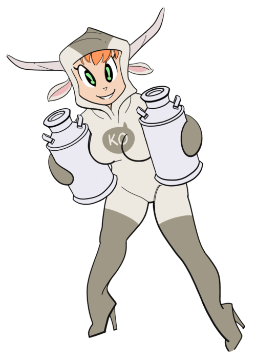

# Resources for making comics, mostly in Krita.

* Customizable vector [comic book templates](https://github.com/ko-koriander/ko-templates)
* Comic book writing system (about to post)
* Preset brushes for creating comics in Krita (currently revising for version 5)

- 🐮 Hi, this is Koriander @ko-koriander
- 🧐 Sometimes known as Saeger Ryman
- 🔥 Among other things
- 🎨 I’m interested in posting art resources
- 🗯️ Mostly for writing and drawing comics
- 🖌️ Particularly for the Krita art app
- 📮 My email is saegerart@gmail.com

What you should find here: various templates for drawing comics, a Markdown-related system for writing comic book scripts, and brush sets.

<!---
konstbocker/konstbocker is a ✨ special ✨ repository because its `README.md` (this file) appears on your GitHub profile.
You can click the Preview link to take a look at your changes.
--->
